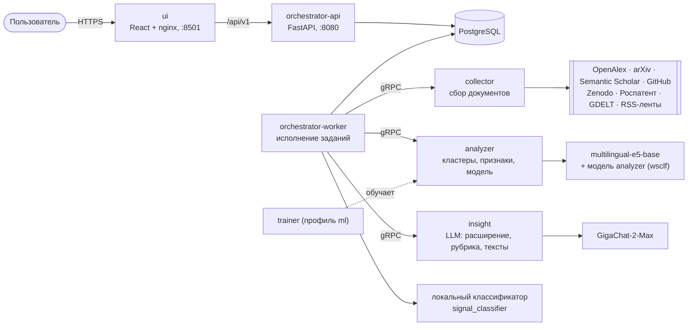

# Weak Signals — обзор системы

Сервис автоматически ищет **слабые сигналы**: конкретные технологии на ранней стадии, которые ещё не стали мейнстримом. Пользователь вводит направление в свободной форме — например, «перспективные решения в финтехе». Система собирает материалы из открытых источников, отделяет ранние технологии от зрелых трендов, стандартов, хайпа и шума и формирует ТОП-15 карточек. В каждой карточке есть описание, преимущество, кейс-пример, источники, уверенность модели и объяснение решения.

- **Демонстрационный стенд:** <https://ws.race-src.com>
- **Развёртывание и быстрый старт:** [README.md](README.md)
- **Изменения контрактов и версий:** [CHANGELOG_CONTRACTS.md](CHANGELOG_CONTRACTS.md)

## Содержание
1. [Архитектура](#архитектура)
2. [Конвейер обработки запроса](#конвейер-обработки-запроса)
3. [Методика принятия решений](#методика-принятия-решений)
4. [Модели и их проверка](#модели-и-их-проверка)
5. [Источники и доверие](#источники-и-доверие)
6. [Ограничения](#ограничения)
7. [Карта документации](#карта-документации)

## Архитектура

Логика сбора, анализа, генерации текстов и интерфейса разделена по отдельным сервисам. Каждый сервис — свой Docker-контейнер. Сервисы общаются по gRPC, и у каждого своя схема в PostgreSQL.

| Сервис | Ответственность |
|---|---|
| `collector` | Поиск и загрузка документов из открытых источников с учётом их лимитов, нормализация, метки типа и доверия |
| `analyzer` | Дедупликация, эмбеддинги e5, кластеризация, 25 интерпретируемых признаков, модель analyzer и правила → кандидаты |
| `insight` | Вызовы GigaChat: расширение запроса, рубричная оценка кандидатов, доводка карточек на русском языке |
| `orchestrator` | API, очередь заданий, управление стадиями, решение о выдаче, уверенность, исключённые кандидаты |
| `ui` | Аналитическая панель: запрос, ТОП карточек, страница инсайта, исключённые кандидаты, модель, методология |
| `trainer` | Сборка датасета и обучение модели analyzer, отчёты оценки |

Подробная схема — [docs/architecture.puml](docs/architecture.puml), контракт API — [docs/api/orchestrator.openapi.yaml](docs/api/orchestrator.openapi.yaml).

## Конвейер обработки запроса

1. **Расширение запроса.** GigaChat строит до 8 поисковых фраз на русском и английском языках. Удачные расширения кешируются с учётом версии промпта, неудачные в кеш не попадают.
2. **Сбор.** Восемь источников опрашиваются параллельно в пределах бюджета времени, с паузами и таймаутами, которых требует каждый из них. Отказ одного источника или одной RSS-ленты не останавливает остальные.
3. **Анализ.** Дубликаты удаляются, документы группируются по темам. Близость к запросу считается к ближайшей поисковой фразе. Для каждой группы считаются признаки, модель analyzer и правила упорядочивают до 40 кандидатов. Заметки СМИ не склеиваются между собой.
4. **Рубрика.** Языковая модель оценивает каждого кандидата: относится ли он к запросу, конкретна ли технология, ранняя ли стадия, проверяемы ли источники. Она же называет технологию и составляет её профиль по источникам.
5. **Классификатор.** Локальная модель оценивает профиль технологии: упорядочивает признанных кандидатов и задаёт уверенность.
6. **Доводка.** Для каждой карточки языковая модель пишет описание, преимущество, кейс-пример и объяснение **только по фактам выбранных источников**:
   - в названии — оригинальный термин из источников;
   - числа, которых нет в источниках, удаляются;
   - несвязанные источники отбрасываются;
   - иноязычные источники получают русское резюме с пометкой «генеративное резюме».
7. **Финальная проверка.** Готовая карточка ещё раз проходит рубрику: общие понятия, зрелые технологии, обзоры и темы не по запросу заменяются следующими кандидатами. Отклонённое не возвращается ни в какой ветке.
8. **Выдача.** ТОП-N карточек, счётчики задания и список исключённых кандидатов с причинами.

## Методика принятия решений

**Кто что решает:**
- решение «слабый сигнал или нет» принимает **рубрика языковой модели**;
- **порядок и уверенность** задаёт **локальный классификатор**, обученный на размеченных данных;
- **правила** проверяют требования ТЗ к источникам.

| Код рубрики | Значение | Итог |
|---|---|---|
| `R` | Конкретная технология ранней стадии, по теме, с проверяемыми источниками | Слабый сигнал, в выдачу |
| `U` | Данных недостаточно | Только добор, если признанных меньше минимума, с пометкой «требует проверки» |
| `N-OFF` | Не по теме; для «безопасности систем X» — не защищает сами системы X | Исключён |
| `N-GEN` | Общее понятие без конкретной технологии | Исключён |
| `N-OVR` | Обзор или аналитика | Исключён |
| `N-MAT` | Массовое внедрение, отраслевой стандарт, выраженные лидеры | Исключён |
| `N-HYP` / `N-NOI` / `N-FUND` | Хайп / шум / только новость о финансировании | Исключён |

**Требование ТЗ к источникам.** Пресс-релизы, блоги и репозитории кода не могут быть единственным основанием. Кандидат без независимого источника исключается ещё до рубрики.

**Уверенность.** Это вероятность локального классификатора, показанная по шкале: для признанного сигнала — 0,5 + 0,5 × вероятность. Шкала отражает решение рубрики и сохраняет порядок внутри признанных, но **не является статистически откалиброванной вероятностью**. Полоса High начинается с 0,75, и счётчик «уверенность выше 75 %» считает по тому же значению, что показано в карточках.

**Признаки.** В карточке показываются вклады признаков локального классификатора и признаки модели analyzer. Классификатор учитывает отрицание: «нет массового внедрения» — это признак ранней стадии, а не зрелости.

Полное описание методики доступно в интерфейсе, в разделе «Методология». Решения по сервисам — в `docs/*/DECISIONS.md`.

## Модели и их проверка

| Модель | Назначение | Как проверена |
|---|---|---|
| **Локальный классификатор** (`services/orchestrator/config/signal_classifier.json`) | Порядок и уверенность в выдаче | 5 фолдов по датасету организаторов (225 строк) плюс собственный датасет (134 строки): accuracy 0,907, precision 0,907, recall 0,880, F1 0,893, каждый фолд ≥ 0,84. Отчёт — `ml/reports/signal_classifier/report.json` |
| **Модель analyzer** (`wsclf`) | Упорядочивание кандидатов до рубрики, признаки | Отложенный тест 20 % использован один раз, гиперпараметры, калибровка и порог выбраны на `RepeatedStratifiedKFold`. Отчёт — [docs/ml/evaluation_report.md](docs/ml/evaluation_report.md), карточка модели — [docs/ml/MODEL_CARD_v2.md](docs/ml/MODEL_CARD_v2.md) |
| **Рубрика GigaChat** | Решение о слабом сигнале, стадия и тренд | Проверена на датасете организаторов: протокол — [docs/ml_rework/PROTOCOL.md](docs/ml_rework/PROTOCOL.md), результаты — [docs/ml_rework/RESULTS.md](docs/ml_rework/RESULTS.md) |

Разметка данных описана в [docs/ml/labeling_protocol.md](docs/ml/labeling_protocol.md).

## Источники и доверие

| Источник | Что даёт |
|---|---|
| OpenAlex | Научные публикации, в том числе статьи arXiv через фильтр источника |
| arXiv | Свежие препринты. Лимит — не чаще 1 запроса в 3 с, после отказа по лимиту источник пропускается |
| Semantic Scholar | Научные публикации. Нужен API-ключ `WS_SEMANTIC_SCHOLAR_API_KEY` |
| GitHub | Реализации и прототипы, только как дополнительное свидетельство |
| Zenodo | Препринты, данные, отчёты |
| Роспатент | Патенты |
| GDELT | Мировые новости. Жёсткий лимит частоты по IP |
| RSS-ленты | Отраслевые медиа (параметр `WS_COLLECTOR_RSS_FEEDS`) |

Уровни доверия:
- **HIGH** — научные публикации, патенты, официальные материалы;
- **MEDIUM** — отраслевые медиа, репозитории, самопубликации;
- **LOW** — пресс-релизы, блоги, соцсети.

Для каждого источника в интерфейсе показываются название, ссылка, дата, тип, язык и доверие. Словарь настроек — [docs/config_dictionary.md](docs/config_dictionary.md).

## Ограничения

- Отрицательный класс для обучения размечен командой, а не организаторами. Тексты классов написаны разными авторами, поэтому офлайн-метрики могут быть выше, чем на живой выдаче.
- Уверенность — шкала на основе вероятности классификатора, а не откалиброванная вероятность, см. «Методика».
- Полнота сбора зависит от внешних API: при превышении их лимитов часть документов в задании не собирается.
- Без доступа к языковой модели карточки собираются резервным генератором и помечаются в выдаче.
- Система предлагает гипотезы для эксперта и не заменяет экспертную оценку.

## Карта документации

| Раздел | Документы |
|---|---|
| Архитектура и API | [docs/architecture.puml](docs/architecture.puml) · [docs/api/orchestrator.openapi.yaml](docs/api/orchestrator.openapi.yaml) · [docs/ml_rework/ARCHITECTURE.md](docs/ml_rework/ARCHITECTURE.md) |
| Решения и тесты по сервисам | collector: [решения](docs/collector/DECISIONS.md), [тесты](docs/collector/TEST_REPORT.md) · analyzer: [решения](docs/analyzer/DECISIONS.md), [тесты](docs/analyzer/TEST_REPORT.md) · insight: [решения](docs/insight/DECISIONS.md), [тесты](docs/insight/TEST_REPORT.md) · orchestrator: [решения](docs/orchestrator/DECISIONS.md), [тесты](docs/orchestrator/TEST_REPORT.md) · ui: [решения](docs/ui/DECISIONS.md), [тесты](docs/ui/TEST_REPORT.md) |
| Машинное обучение | [решения](docs/ml/DECISIONS.md) · [карточка модели](docs/ml/MODEL_CARD_v2.md) · [отчёт оценки](docs/ml/evaluation_report.md) · [тесты](docs/ml/TEST_REPORT.md) · [протокол разметки](docs/ml/labeling_protocol.md) |
| Переработка ML: исследование и результаты | [аудит](docs/ml_rework/AUDIT.md) · [исследование](docs/ml_rework/RESEARCH.md) · [гипотезы](docs/ml_rework/HYPOTHESES.md) · [протокол](docs/ml_rework/PROTOCOL.md) · [результаты](docs/ml_rework/RESULTS.md) · [матрица требований ТЗ](docs/ml_rework/REQUIREMENTS_MATRIX.md) · [ход работ](docs/ml_rework/PROGRESS.md) · [журнал](docs/ml_rework/CHANGELOG.md) · [реестр файлов](docs/ml_rework/FILE_REGISTRY.md) · [миграция и откат](docs/ml_rework/MIGRATION_ROLLBACK.md) |
| Качество выдачи | [базовые прогоны](docs/quality/baseline_runs_table.md) · [данные прогонов](docs/quality/baseline_runs.csv) |
| Настройки | [словарь конфигурации](docs/config_dictionary.md) · [`.env.example`](.env.example) |
